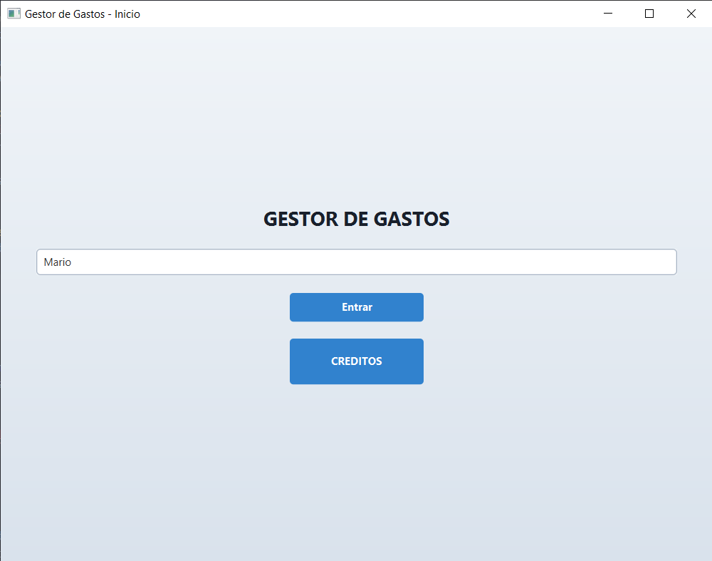
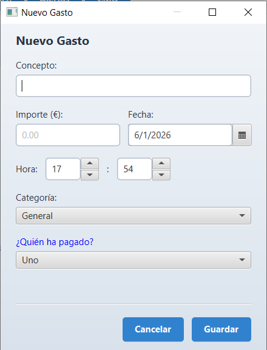
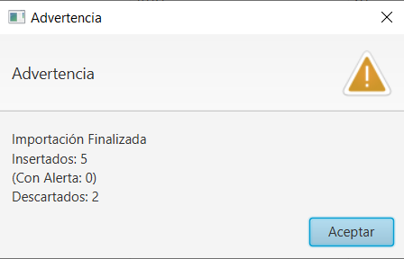
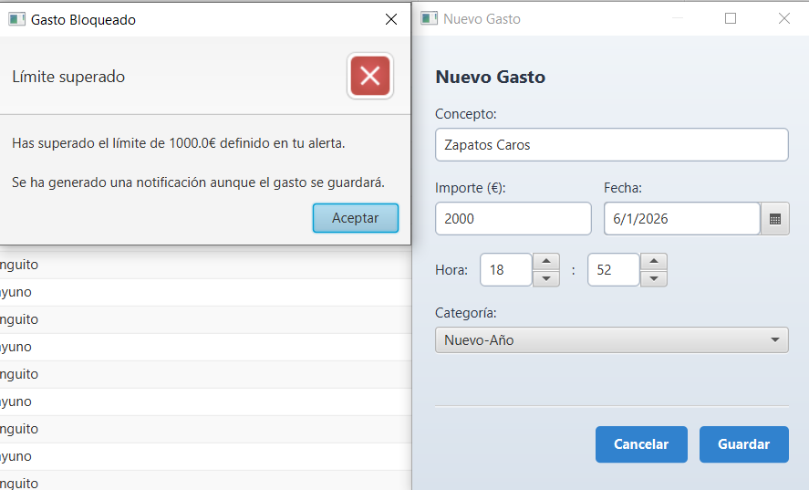
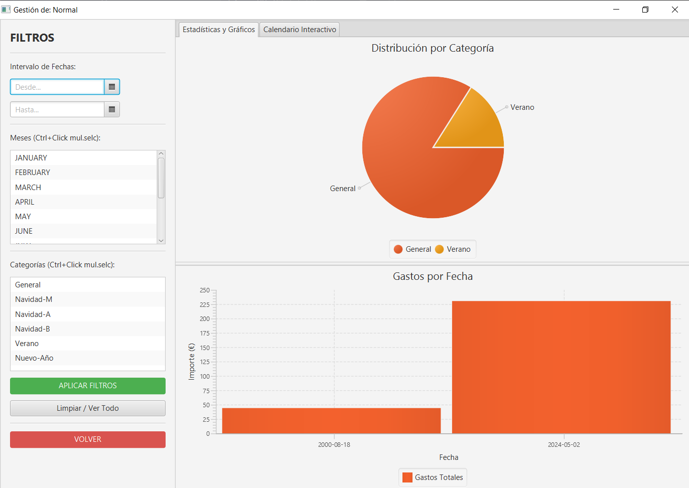
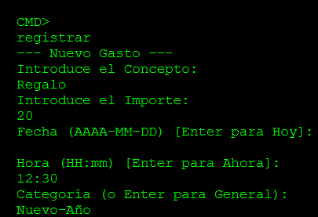

# 📘 Manual de Usuario - Gestor de Gastos

Bienvenido al **Gestor de Gastos**, la solución diseñada para el control financiero personal y compartido. En esta aplicación se combina una interfaz gráfica moderna con herramientas de importación y análisis de datos.

**Versión:** 1.0.0  
**Curso:** 2025/2026

---

## 📑 Índice
1. [Instalación y Arranque](#1-instalación-y-arranque)
2. [Pantalla de Cuentas](#2-pantalla-de-cuentas)
3. [Pantalla de Gastos](#3-pantalla-de-gastos)
4. [Gestión de Cuentas ](#4-gestión-de-gastos)
5. [Importación Inteligente de Datos](#5-importación-inteligente-de-datos)
6. [Sistema de Seguridad y Alertas](#6-sistema-de-seguridad-y-alertas)
7. [Análisis Visual y Estadísticas](#7-análisis-visual-y-estadísticas)
8. [Modo Avanzado: Terminal y Logs](#8-modo-avanzado-terminal-y-logs)
9. [Créditos y Autores](#9-créditos-y-autores)

---

## 1. Instalación y Arranque

**Requisitos Previos**
* **Java JDK:** Versión 17 o superior (Recomendado Java 21).
* **Maven:** Para la gestión de dependencias.*
* **IDE:** Eclipse, IntelliJ IDEA o NetBeans (con soporte para JavaFX).*

**Opción 1: Ejecución desde Eclipse (Recomendada)**
1. Importar el proyecto como "Existing Maven Project".
2. Hacer clic derecho sobre el proyecto > Maven > Update Project (para descargar dependencias).
3. Buscar la clase principal: gestorgastos.app_gastos.App (o Main).
4. Hacer clic derecho > Run As > Java Application.

**Opción 2: Ejecución mediante Terminal (Maven)**
1. Abre una terminal en la raíz del proyecto y ejecuta:
```bash
mvn clean javafx:run
```


**Login** 
* Nada mas ejecutar la aplicación, le aparecerá un ventana donde deberá elegir un nombre de usuario, aunque esto es meramente estético ya que la aplicación es monousuario.



---

## 2. Pantalla de Cuentas 

El panel principal es el centro de cuentas del usuario. Está diseñado para ofrecer un listado de todos las cuentas creadas por el usuario.

**Componentes Principales:**
* **Selector de Cuenta:** Permite alternar entre sus cuentas personales y compartidas.
* **Creacion de Cuenta:** Permite crear cualquiera de los 3 tipos de cuenta
    1. **Cuenta normal:** Cuenta con solo un participante
    2. **Cuenta compartida:** Cuenta con más de un participantes ( la lista de participantes no podrá ser editada) donde el reparte de gastos se hace equitativamente ( 50% )
    3. **Cuenta especial ( cuenta compartida de nivel 2):** Funciona igual que la cuenta compartida solo que al crear la lista de participantes podremos elegir cuanto porcentaje del total pagarán, siempre y cuando la suma de este entre todos sea del 100%.


---

## 3. Pantalla de Gastos

La pantalla de gastos es la base de la cuenta elegida. En ella principalmente tenemos una lista con nuestor gasto asi como de varias funcionalidades.

**Componentes Principales::**
* **Lista de Gastos:** Una lista de los gastos creados con sus atributos (concepto, importe, fecha y hora, categoria...)
* **Botones de interaccion con Gastos:** Ademas se incluyen varios botones con las siguiente funcioanlidades:
     1. Creacion de un gasto
     2. Edición de un gasto
     3. Eliminación de un gasto
     4. Importacion de gastos desde distintos tipos de ficheros
        * Actualmente soporta archivos Excel, JSON, CSV, TXT, XML
* **Menu de interaccion:** Se incluye ademas en la parte superior un menú sencillo con acceso a otras funcionalidades de la aplicacion y aplicables a la cuenta seleccionada


---


## 4. Gestión de Gastos

### Añadir un Nuevo Gasto
Pulse el botón **"Añadir Gasto"** para desplegar el formulario de registro.

1.  **Concepto:** Descripción breve (ej: "Cena de empresa").
2.  **Importe:** Valor numérico (soporta decimales con punto o coma).
3.  **Fecha y Hora:** Selector de calendario y reloj.
4.  **Categoría:** Clasificación del gasto (Comida, Hogar, Ocio...). 
    * Si no se tiene ninguna categoría creada o no se selecciona ninguna, se establece el gasto creado con la categoría GENERAL
5.  **Pagador:** (Solo en cuentas compartidas y especiales) Seleccione quién realizó el pago.

> **Validación:** El sistema impedirá guardar el gasto si faltan datos obligatorios o si el formato del importe es incorrecto o si se ha superado un limite impuesto por el usuario ( explicado con mas detalle mas adelante)



---


## 5. Importación Inteligente de Datos

Olvídese de introducir datos a mano. El sistema permite la carga masiva desde ficheros externos.

**Formatos Soportados:**
* **Excel (.xlsx)** 
* **CSV (.csv)**
* **JSON (.json)** 
* **TXT (.txt)**
* **XML (.xml)**

**Lógica de Importación:**
El sistema es "inteligente" y realiza filtros automáticos:
1.  **Validación de Miembros:** Si un archivo contiene un gasto pagado por un usuario que no pertenece a la cuenta destino (ej: "Paquito" en una cuenta donde solo están "Mario" y "Alejandro"), el gasto se **descarta automáticamente**.
2.  **Asignación de Cuentas:** Detecta a qué cuenta pertenece cada línea del fichero.



---

## 6. Sistema de Seguridad y Alertas

Para evitar errores o gastos desorbitados, la aplicación cuenta con un **sistema de alertas activo**.

* **Funcionamiento:** Si intenta crear o importar un gasto que supere el límite establecido (por defecto **1000€**), la operación será bloqueada.
* **Notificación:** El gasto no se guardará, y en su lugar, se generará una notificación en el sistema indicando el intento rechazado.

> **Ejemplo:** Al importar un gasto de 2000€ concepto "Abrigo Caro", el sistema lo ignorará y le avisará: *"Has superado el límite definido en tu alerta"*.



---

## 7. Análisis Visual y Estadísticas

Entienda sus finanzas mediante herramientas visuales interactivas situadas en el panel principal.

* **Gráfico de Sectores (Pie Chart):** Muestra el porcentaje de gasto por categoría.
    * *Interactividad:* Pase el ratón por encima de cada sección ("quesito") para ver el importe exacto gastado en esa categoría.
    * *Colores:* Cada categoría tiene un color asignado para fácil identificación (Verde=Hogar, Rojo=Ocio, etc.).
* **Actualización en Tiempo Real:** Los gráficos se redibujan automáticamente al añadir, editar o importar gastos.



---

## 8. Modo Avanzado: Terminal y Logs

Para usuarios técnicos o depuración, la aplicación ofrece una salida detallada por consola .

### 🖥️ Logs de Actividad
La terminal muestra en tiempo real lo que ocurre "bajo el capó":
* **Traza de Importación:** Verá línea a línea qué gastos se aceptan y cuáles se descartan y el motivo exacto (ej: *"Descartado por ALERTA"*, *"Usuario no asociado"*).


### ⌨️ Entrada por Comandos
Es posible interactuar con la aplicación sin interfaz gráfica (si se habilita el modo consola):
1.  Seleccione la opción de crear gasto en el menú de texto.
2.  Introduzca Concepto, Importe y Categoría siguiendo las instrucciones.
3.  El gasto se sincronizará inmediatamente con la base de datos visual.



---

## 9. Créditos y Autores

Esta aplicación ha sido desarrollada para la asignatura **Tecnologías de Desarrollo Software**.

**Equipo de Desarrollo:**
* **Mario Franco Alcázar** 
* **Alejandro López Galián** 
* **Jaime Martínez Ríos** 

